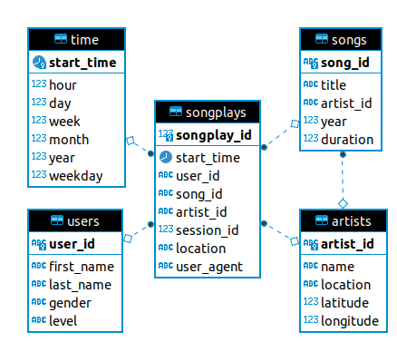
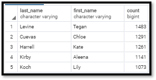
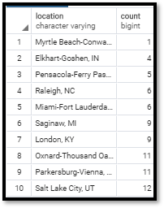

# Data Modeling With Postgres
Project repo for the Udacity Data Engineering Program Project 1.

This README file includes a summary of the project, how to run the Python scripts, and an explanation of the files in the repository.

## Getting Started

1.  You will need to first connect and build the tables for the  Sparkify database.  To do this run the following command:

> python db_init.py

2. To load data into the  Sparkify database run the following command:

>python etl.py

## Prerequisites
1.  Baseline configured PostgreSQL database.

2.  The following Python libraries need to be installed in the environment.
    * psycopg
    * pandas

## Purpose
The purpose of this database is to conduct ETL operations and store data from user activity from the Sparkify app.  
This data will be used by the Sparkify analytics team will use this data gain a greater understanding of user activity and songs being listened to.

## Database Schema
There are 5 tables in the database.  This design focuses on the songplay table which houses the most important information for the analytics team.  The supporting tables of time, users, songs, and artists help to provide context and additional details for the songplay table.

## Example Queries
To get the top 5 users by songplays.

    SELECT users.last_name, users.first_name, COUNT(songplay.user_id) AS songplays_count
    FROM songplay
    INNER JOIN users ON songplay.user_id=users.user_id
    GROUP BY users.user_id
    ORDER BY songplays_count DESC
    LIMIT 5;

To get the 10 locations with the least amount of user sessions

    SELECT songplay.location, COUNT(songplay.location)
    FROM songplay
    WHERE location is not null
    GROUP BY songplay.location
    ORDER BY count
    LIMIT 10;

